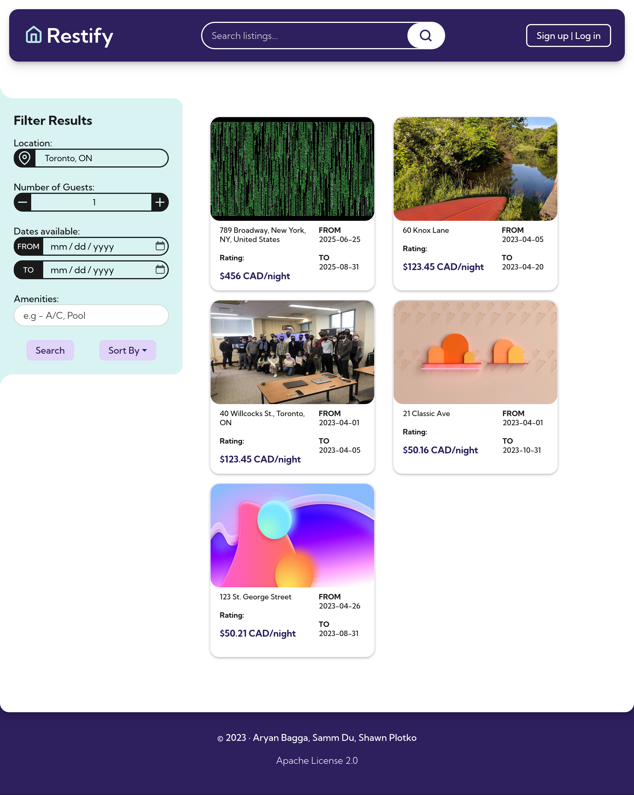
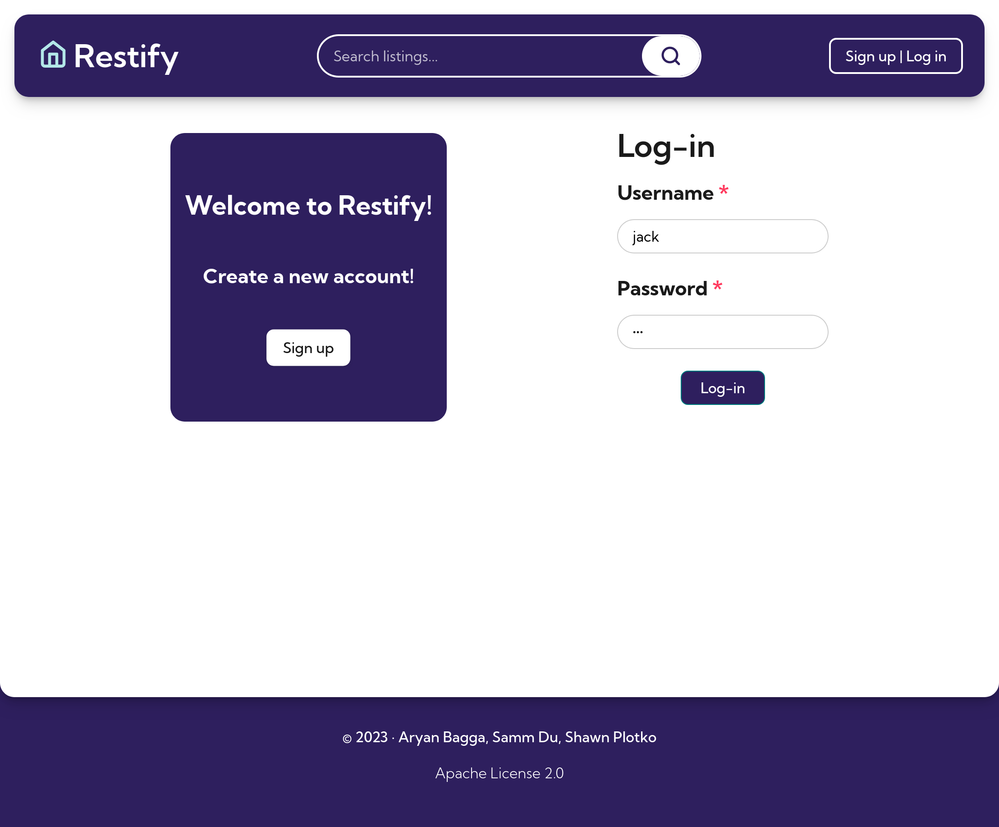
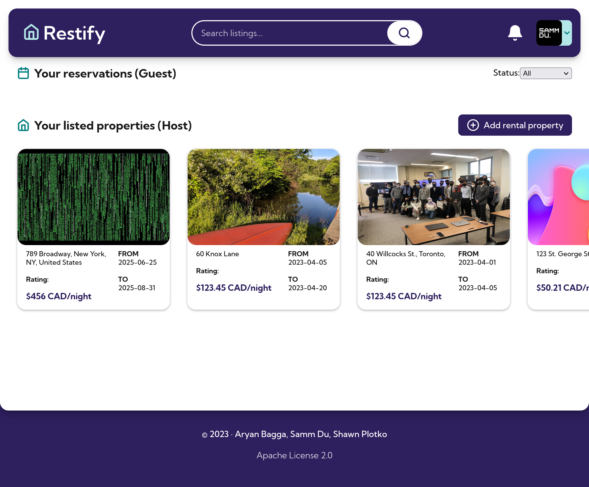
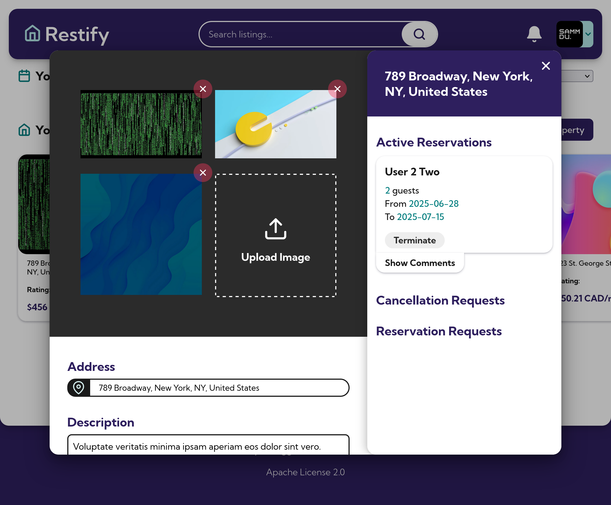
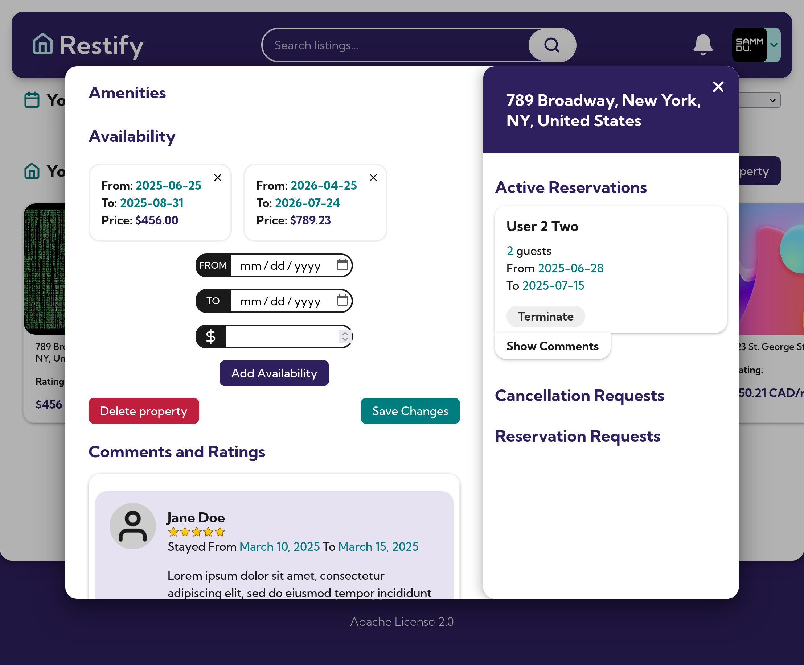

# Restify

An online marketplace where users can search, book, comment and rate short term lodging experiences. University of Toronto CSC309 project.

## Architecture

-   **👉 Backend:** [Django](https://www.djangoproject.com/), [Django REST framework](https://www.django-rest-framework.org/)
    -   📖 [Backend README](backend/README.md)
-   **👉 Frontend:** [React.js](https://react.dev/), [React Router](https://reactrouter.com/en/main)
    -   📖 [Frontend README](frontend/README.md)

## Screenshots

### Home Page

### Login

### Host Dashboard

### Property Edit Modal (1)

### Property Edit Modal (2)

## Local Development

#### Automatic Setup & Run Scripts

-   When setting up on Linux, the setup steps can simply be replaced by [`./startup.sh`](startup.sh)
-   When running on Linux, the running steps can simply be replaced by [`./run.sh`](run.sh)

#### Manual Setup

See [frontend-/backend- specific READMEs](#architecture).
